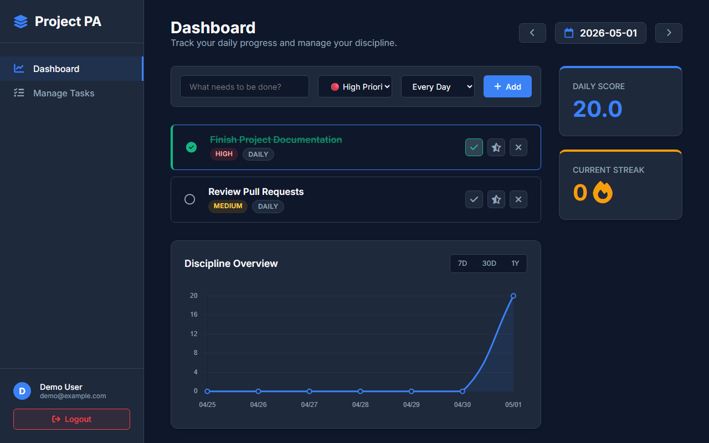

# 📘 Task Management: Smart Discipline & Habit Tracking System

> A modern, priority-based habit tracker designed to measure real discipline through weighted scoring and visual progress analytics.



## 🎯 The Problem
Traditional to-do lists treat all tasks equally. Checking off "Take a break" gives the same visual reward as "Study for 3 hours". This leads to a false sense of productivity and lack of real discipline.

## 💡 The Solution
**Task Management** introduces a **Smart Discipline Engine** that evaluates your performance based on:
1. **Task Priority**: High (20pts), Medium (10pts), Low (5pts).
2. **Completion Level**: Full Completion (100%), Partial/Half Effort (50%), or Missed (Negative Penalty).
3. **Consistency**: Tracks your active daily streaks and visualizes your progress over time.

---

## ✨ Key Features
- **SaaS-Grade UI**: A premium dark-theme interface utilizing CSS Grid, Glassmorphism, and responsive design.
- **Smart Recurring Tasks**: Create "Every Day" master tasks that the engine automatically generates for you every single day.
- **Date Time-Travel**: Navigate seamlessly between past days to review historical performance or future days to pre-plan your schedule.
- **Visual Progress Analytics**: An interactive Chart.js line graph that plots your Discipline Score over 1 Week, 1 Month, or 1 Year.
- **Dedicated Task Management**: A centralized hub to oversee, edit, and safely delete your master task definitions.

---

## 🏗️ System Architecture & Technologies

### 1. Presentation Layer (Frontend)
- **HTML5 & Vanilla CSS**: Custom-built styling system (No Tailwind/Bootstrap) to ensure maximum flexibility and a unique aesthetic.
- **FontAwesome**: Professional iconography.
- **Chart.js**: Dynamic data visualization.

### 2. Application Layer (Backend)
- **Python (Flask)**: The core engine handling routing, authentication, and the weighted scoring logic.
- **Flask-Login**: Secure session management and user authentication.
- **Werkzeug**: Robust password hashing (`scrypt`).

### 3. Data Layer (Database)
- **SQLite**: Lightweight, file-based database configured via SQLAlchemy ORM.
- **Relational Models**: Separated `Task` (Definitions) from `TaskInstance` (Daily Executions) to support complex recurrence.

### 4. DevOps & Deployment
- **Docker**: Containerized via `Dockerfile` for environment-agnostic execution.
- **Gunicorn**: Production-grade WSGI HTTP Server.
- **Render.com ready**: Includes `render.yaml` for instant Infrastructure-as-Code deployment.

---

## 🚀 How to Run Locally

### Option 1: Using Python
1. Clone the repository:
   ```bash
   git clone https://github.com/YOUR_USERNAME/project-pa.git
   cd project-pa
   ```
2. Create and activate a virtual environment:
   ```bash
   python -m venv venv
   source venv/bin/activate  # On Windows: venv\Scripts\activate
   ```
3. Install dependencies:
   ```bash
   pip install -r requirements.txt
   ```
4. Run the Flask Server:
   ```bash
   python app.py
   ```
5. Open your browser and navigate to `http://127.0.0.1:5000`

### Option 2: Using Docker
1. Build the image:
   ```bash
   docker build -t project-pa .
   ```
2. Run the container:
   ```bash
   docker run -p 5000:5000 project-pa
   ```

---

*Built by a passionate developer focusing on modern web design, backend architecture, and DevOps principles.*
